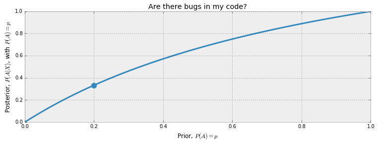
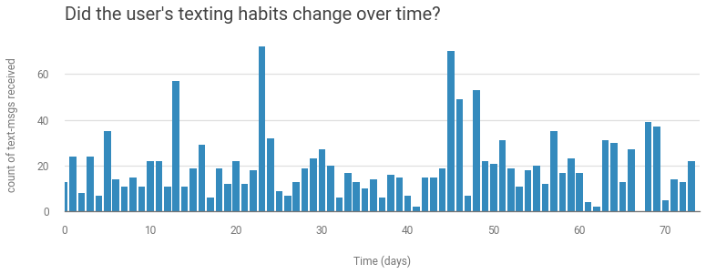
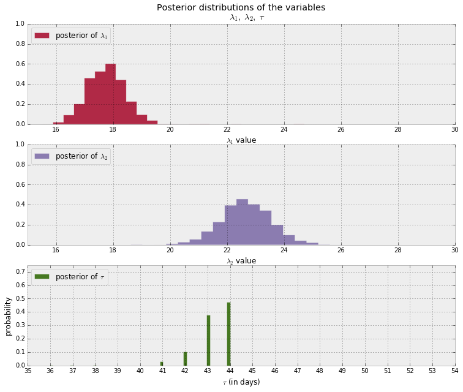

# 1 Introduction

## Bayesian inference

_Frequentist_ statistics assume that probability is the long-run frequency of events.
This becomes difficult when an even has no long-term frequency—
like presidential elections.
Bayesian statistics interpret a probability as a measure of belief.

Our belief about event $A$ is written as $P(A)$—
the _prior probability_.
An updated belief given evidence $X$ is $P(A|B)$,
the _posterior probability_.

Where frequentist methods return a number representing an estimate,
Bayesian methods return probabilities of different values.

As more data is acquired the prior belief is washed out by evidence.
As the number of instances $N$ goes to $\inf$,
Bayesian results often align with frequentist results.
At small $N$,
there is more instability,
and Bayesian method's prior and probabilities reflect that.

$$
P(A \mid X)=\frac{P(X \mid A) P(A)}{P(X)} \\
P(A \mid X) \propto P(X \mid A) P(A)
$$

As $N$ gets larger,
the distribution of posterior probability values gets sharper.
The uncertainty is proportional to the width of the curve.

### Bug or no bug

Let $A$ be an event that our code has no bugs.
Let $X$ be the even that the code passes all tests.
The prior will be set as a variable $P(A) = p$.
We want $P(A | X)$.

$$
P(X | A) = 1 \\
P(X) = P(X \text{ and } A) + (X \text{ and } \sim A) \\
= P(X | A)P(A) + P(X | \sim A)P(\sim A) \\
= P(X | A)p + P(X | \sim A)
$$

$P(X | \sim A)$ is subjective—
the code can pass and still have bugs.
We can estimate $P(X | \sim A) = 0.5$.
Then

$$
\begin{aligned}
P(A \mid X) &=\frac{1 \cdot p}{1 \cdot p+0.5(1-p)} \\
&=\frac{2 p}{1+p}
\end{aligned}
$$

We can plot out the posterior probability as a function of prior values between 0 and 1
($p \in [0,1]$).



Since $P(A | X )$ is the probability that there is no bug given we saw all tests pass,
$1 - P(A | X )$ is the probability that there is a bug given all tests pass.

## Probability distributions

If $Z$ is a random variable.
Then associated with $Z$ is a probability distribution function that assigns probabilities to the different outcomes $Z$ can take.

$Z$ can be:

1. Discrete. Only assume specific values.
2. Continuous. Any exact value.
3. Mixed. Both continuous and discrete.

### Discrete

When discrete $Z$'s distribution is called a _probability mass function_
and measures the probability $Z$ takes on the value $k$—
$P(Z = k)$.

One is the _Poisson_ distribution.

$$
P(Z=k)=\frac{\lambda^{k} e^{-\lambda}}{k !}, \quad k=0,1,2, \ldots
$$

Where $\lambda$ is called the parameter of the distribution.
It controls the shape.
For Poisson,
$\lambda$ is any positive number.
Higher $\lambda$ means more probability to larger values.
It is the _intensity_ of the Poisson distribution.

$k$ is a non-negative integer.

It can be written as

$$
Z \sim \text{Poi}(\lambda)
$$

In the Poisson distribution the expected value is equal to the parameter:

$$
E\large[ \;Z\; | \; \lambda \;\large] = \lambda
$$

## Continuous

When continuous,
the distribution is a _probability density function_.
One such distribution is a random variable with _exponential density_.

$$
f_Z(z | \lambda) = \lambda e^{-\lambda z }, \;\; z\ge 0
$$

An exponential random variable can only take on non-negative values,
but they don't have to be integers.

Can be written as

$$
Z \sim \text{Exp}(\lambda)
$$

$$
E[\; Z \;|\; \lambda \;] = \frac{1}{\lambda}
$$

## What is $\lambda$?

$\lambda$ isn't real.
We can talk about what $\lambda$ is likely to be by assigning a probability distribution to it.

## Text-message data

Model rate at which a user sends and receives text messages.
Want to know if the user's text-messaging habits have changed over time.



This is count data,
so we can use a Poisson random variable to represent this.

$$
C_i \sim \text{Poisson}(\lambda)
$$

Where $C_i$ is the day $i$'s text message count,
and $\lambda$ is still unknown.
The plot makes it seem that the rate increases at some point—
meaning $\lambda$ increase.
A higher value of $\lambda$ means move probability to larger outcomes.

We can assume that on some day—
$\tau$—
$\lambda$ jumps to another value.
We have two $\lambda$'s—
one before $\tau$ and one after.
A sudden transition like this is called a _switchpoint_.

$$
\lambda =
\begin{cases}
\lambda_1  & \text{if } t \lt \tau \cr
\lambda_2 & \text{if } t \ge \tau
\end{cases}
$$

If there is no change,
then $\lambda_1 = \lambda_2$.

We need to assign prior probabilities to the possible values for $\lambda$.
$\lambda$ can be any positive number.
The exponential distribution provides a density for positive numbers.
But exponential distributions have a parameter of their own—
which we we label $\alpha$.

$$
\begin{array}{l}
\lambda_{1} \sim \operatorname{Exp}(\alpha) \\
\lambda_{2} \sim \operatorname{Exp}(\alpha)
\end{array}
$$

$\alpha$ is a _hyper-parameter_ or _parent variable_—
a parameter than influences other parameters.
The initial guess of $\alpha$ does not influence the model too much.
Good rule of thumb is to set the parameter equal to the inverse of the average of the count data.
Since we are modeling $\lambda$ with an exponential distribution,
we can use the expected value identity:

$$
\frac{1}{N}\sum_{i=0}^N \;C_i \approx E[\; \lambda \; |\; \alpha ] = \frac{1}{\alpha}
$$

Another method is to have two priors—
one for each $\lambda_i$.
Two exponential distributions with different $\alpha$ values reflects the prior belief
that the rate changes at some point.

$\tau$ is difficult to pick out intuitively in the data.
We can assign a _uniform prior belief_ to each possible day:

$$
\begin{array}{l}
\tau \sim \text { DiscreteUniform }(1,70) \\
\Rightarrow P(\tau=k)=\frac{1}{70}
\end{array}
$$

### Using PyMC3

Can code up this model in PyMC3:

```python
import pymc3 as pm
import theano.tensor as tt

with pm.Model() as model:
    alpha = 1.0 / count_data.mean()  # count_data holds the data
    lambda_1 = pm.Exponential("lambda_1", alpha)
    lambda_2 = pm.Exponential("lambda_2", alpha)
    tau = pm.DiscreteUniform(
      "tau",
      lower=0,
      upper=n_count_data - 1,  # n_count_data holds the shape of the data
    )
```

Here `lambda_1` and `lambda_2` are _stochastic variables_—
they are treated by the back end as random number generators.

```python
with model:
    idx = np.arange(n_count_data) # Index
    lambda_ = pm.math.switch(tau > idx, lambda_1, lambda_2)
```

`lambda_` is a function that acts like a new random variable.
`switch()` assigns `lambda_1` or `lambda_2` as the value of `lambda_`—
depending on which side of `tau` we are on.
The values of `lambda_` up until `tau` are `lambda_1`,
values after are `lambda_2`.

```python
with model:
  observation = pm.Poisson("obs", lambda_, observed=count_data)
```

`observation` combines our data—
`count_data`—
with the proposed data generation scheme.

```python
with model:
    # Unexplained for now
    step = pm.Metropolis()
    trace = pm.sample(10000, tune=5000, step=step)
```

We use _Markov Chain Monte Carlo_—
to return thousands of random variables from the posterior distributions.
The samples as called _traces_.



Bayesian methodology returns a _distribution_.
The wider the distribution,
the less certain we are.
But we can see that the two $lambda$s are distinct.

The posterior distributions of the $lambda$s do not look like exponential distributions—
even though our priors were exponential.
That is okay.

The $\tau$ distribution says that in day 44 there is a 50% chance that a user's behavior changed.
Had no changed occurred,
the distribution would be more spread out.

### What is the expected number of texts?

What is the expected number of text on day $t$?
The expected value of a Poisson variable is equal to $\lambda$.
Therefore,
the question is:
_what is the expected value of $\lambda$ at time $t$_?

Let $i$ index samples form the posterior distributions.
Given a day $t$,
we average over all possible $\lambda_i$ for the day $t$.
If $t \lt \tau_i$ then $\lambda_i = \lambda_{1,i}$,
else $\lambda_i = \lambda_{2,i}$.

```python
lambda_1_samples = trace["lambda_1"]
lambda_2_samples = trace["lambda_2"]
tau_samples = trace["tau"]

N = tau_samples.shape[0]
expected_texts_per_day = np.zeros(n_count_data)
for day in range(0, n_count_data):
    ix = day < tau_samples  # A bool index of tau samples corresponding to switchpoint
    expected_texts_per_day[day] = (
      lambda_1_samples[ix].sum()
      + lambda_2_samples[~ix].sum()
      / N
    )
```


Plot shows support for belief that behavior did change
(as signified by the change)
and that it was sudden
(aa signified by the quick switch).

## Discussion

**How would you statistically determine if the two $\lambda$ are different?**

Can compute $P(\lambda_1 < \lambda_2 | data)$—
the probability that the true value of $\lambda_1$ is smaller than $\lambda_2$.
If number is close to 50%‚
then can't be certain they are different.
You can compute the number of times this happens from the samples of posteriors.

```python
(lambda_1_samples < lambda_2_samples).mean()
```

If you want to know the probability that the values differ by at least a number `d`:

```python
d = 5
((lambda_1_samples - lambda_2_samples) >= d).mean()
```

**What is the expected relative increase?**

```python
((lambda_1_samples - lambda_2_samples) / lambda_2_samples).mean()
```
