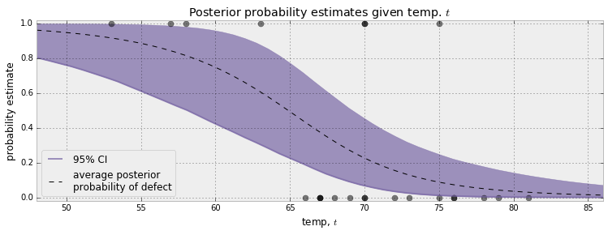

# 2 More PyMC3

## Model

In PyMC3 all variables are handles within the context of the `Model` context.

```python
import pymc3 as pm

with pm.Model() as model:
    parameter = pm.Exponential("poisson_param", 1.0)
    data_generator = pm.Poisson("data_generator", parameter)
```

Any variables created in the context of `Model` will be automatically assigned to that model.

We can continue to work within the context of the same model by using `with` and the name assigned before.

```python
with model:
    data_plus_one = data_generator + 1
```

We can examine the same variables outside of the model context once defined.
But need to be within a context to define more.

```python
parameter.tag.test_value
```

Each variable assigned to a model will be defined with its own name—
the first string parameter.
To create a different model object with the same name as the one we used previously:

```python
with pm.Model() as model:
    theta = pm.Exponential("theta", 2.0)
    data_generator = pm.Poisson("data_generator", theta)
```

If we want to define another separate model,
use another name:

```python
with pm.Model() as ab_testing:
    p_A = pm.Uniform("P(A)", 0, 1)
    p_B = pm.Uniform("P(B)", 0, 1)
```

PyMC3 gives you notifications about transformations when you add variables.
This is done internally to modify the space the variable is sampled in.

## Variables

All variables have an initial (test) value.

```python
parameter.tag.test_value
data_generator.tag.test_value
data_plus_one.tag.test_value
```

`test_value` is used only for the model as a starting point for sampling
if no other start is specified.
The initial state can be changed during creating using the `testval` param.

```python
>>> with pm.Model() as model:
>>>   parameter = pm.Exponential("poisson_param", 1.0, testval=0.5)
>>> parameter.tag.test_value
0.499
```

This can be helpful if you are using an unstabler prior that requires a better starting point.

PyMC3 has two variables:

1. _stochastic variables_ are non-deterministic—
   even if you knew the values of all parameters and components
   it would still be random.
   Like `Poisson`, `DiscreteUniform`, and `Exponential`.
2. _deterministic variables_
   are not random if the parameters and components are known.

### Initializing stochastic variables

Stochastic variables require a `name` argument
plus the additional class-specific parameters.

```python
some_variable = pm.DiscreteUniform("discrete_uni_var", 0, 4)
```

The `name` attribute is used to retrieve the posterior distribution later in the analysis.

Gor multivariable problems,
instead of making an array of stochastic variables
use the `shape` parameter to create a multivariate array of independent stochastic variables.

```python
# Instead of this
beta_1 = pm.Uniform("beta_1", 0, 1)
beta_2 = pm.Uniform("beta_2", 0, 1)
...

# Do this

betas = pm.Uniform("betas", 0, 1, shape=4)
```

### Deterministic variables

```python
deterministic_variable = pm.Deterministic(
  "deterministic variable", some_function_of_variables
)
```

`Deterministic` is not the only way to create deterministic variables.
Elementary options—
addition, exponential, etc—
implicitly create deterministic variables.

```python
with pm.Model() as model:
    lambda_1 = pm.Exponential("lambda_1", 1.0)
    lambda_2 = pm.Exponential("lambda_2", 1.0)
    tau = pm.DiscreteUniform("tau", lower=0, upper=10)

new_deterministic_variable = lambda_1 + lambda_2
```

If we want a deterministic variable to be tracked by our sampling though,
we need to explicitly define it as a named deterministic variable with the constructor.

From the last chapter,
we had a case where

$$
\lambda =
\begin{cases}
\lambda_1  & \text{if } t \lt \tau \cr
\lambda_2 & \text{if } t \ge \tau
\end{cases}
$$

```python
import numpy as np

n_data_points = 5
idx = np.arrange(n_data_points)
with model:
    lambda_ = pm.math.switch(tau >= idx, lambda_1, lambda_2)
```

`switch` here is deterministic.

Inside a deterministic variable,
the stochastic variables behave like scalars
(or NumPy arrays if multivariable).
We can do whatever as long as dimensions match up in the calculations.

```python
def subtract(x, y):
    return x - y

stochastic_1 = pm.Uniform("U_1", 0, 1)
stochastic_2 = pm.Uniform("U_2", 0, 1)

det_1 = pm.Deterministic("Delta", subtract(stochastic_1, stochastic_2))
```

Expressions we are making must be compatible with Theano tensors.

## Theano

Theano does a lot of the heavy lifting in PyMC3.
It is similar to NumPy,
but it builds up a compute graph that tracks operations you want to perform.
Only when you `eval()` does the computation take place—
it is lazy.
Sometimes you need to use theano.

```python
import theano.tensor as tt

with pm.Model() as theano_test:
    p1 = pm.Uniform("p", 0, 1)
    p2 = 1 - p1
    p = tt.stack([p1, p2])
    assignment = pm.Categorical("assignment", p)
```

We can use Theano's `stack()` to combine `p1` and `p2` into a vector with two elements.

## Observations in model

At this point priors have been fully defined.
We can look at prior distribution of $\lambda_1$

```python
lambda_1.random(size=20_000)
```


This is (kinda) $P(A)$.
Now need $X$.

The `observed` argument in stochastic variables.
It fixes the variable's current value to the given data—
typically a NumPy array or Pandas DataFrame.

```python
>>> data = np.array([10, 5])
>>> with model:
>>>     fixed_variable = pm.Poisson("fxd", 1, observed=data)
>>> fixed_variable.tag.test_value
[10 5]
```

This initializes a stochastic variable to have a fixed value.

## Modeling approaches

Think about how data might have been generated.
With the text message data from last chapter,
we can ask:

1. What is the best random variable to describe this count data?
   Poisson represents count data.
2. What do I need for a Poisson distribution?
   Need $\lambda$.
3. Do we know $\lambda$?
   No.
   But we suspect two $\lambda$? values.
   We think there is a switchpoint $\tau$.
4. What is a good distribution for the two $\lambda$s?
   Exponential is good,
   as it assigns probabilities to positive real numbers.
   Call exponential parameter $\alpha$.
5. Do we know what parameter $\alpha$?
   No.
   Could assign another distribution.
   But good to stop once you hit a level of ignorance.
   For $\lambda$ we had some ideas—
   like it changes over time and is between 10–30.
   If we $\alpha$ too low or high,
   it won't reflect what we think about $\lambda$'s range.
   Set $\alpha$ so that the mean of $\lambda_1$ given $\alpha_1$ is equal to the observed date.
6. We have no opinion of when $\tau$ might have occurred.
   We suppose $\lambda$ is from a discrete uniform distribution.


### Generate new datasets

We can create new datasets.
If we reverse the above steps we can simulate a possible realization of the dataset.

1. Specify when the user's behavior switches by sampling from $DiscreteUniform(0, 80)$:

    ```python
    rng = np.random.default_rng(42)
    tau = np.integers(0, 80)
    ```

2. Draw $\lambda_1$ and $\lambda_2$ from $Exp(\alpha)$ distribution.

    ```python
    alpha = 1 / 20
    lambda_1, lambda_2 = rng.exponential(scale=1 / alpha, size = 2)
    ```

3. For days before $\tau$,
   represent the received SMS by sampling from $Poi(\lambda_1)$,
   else $Poi(\lambda_2)$:

   ```python
   import scipy.stats as stats

   data = np.r_[
       stats.poisson.rvs(mu=lambda_1, sie=tau),
       stats.poisson.rvs(mu=lambda_2, size = 80 - tau),
   ]
   ```


It's cool that the generated dataset does not look like the real dataset,
as the probability is very small that it should.

## Bayesian A/B testing

### Simple case

Looking at case $A$ only.
Assume that there is a probability $0 < p_A < 1$
that user shown site $A$ will purchase something.
This is the true effectiveness of site $A$,
and is unknown.

$N$ people are shown site $A$,
$n$ people purchase.
$p_A \ne frac_{n}{N}$—
there is a difference between observed frequency and true frequency of an event.
True frequency can be interpreted as the probability of an event occurring.

For a Bayesian model,
need to assign prior distributions to unknown quantities.
Assume $p_A$ uniform since we have no intuition on it.

```python
import pymc3 as pm

with pm.Model() as model:
    p = pm.Uniform("p", lower=0, upper=1)
```

We can simulate the number of purchases with a _Bernoulli_ distribution.
If $X \sim Ber(p)$,
then $X$ is 1 with probability $p$ and 0 with probability $1 - p$.

```python
# Guess some constants to generate experimental data
p_true = 0.05
N = 1_500
occurrences = stats.bernoulli.rvs(
    p_true, size=N
)  # Generate some data

with model:
    obs = pm.Bernoulli("obs", p, observed=occurrences)
    # Unexplained code
    step = pm.Metropolis()
    trace = pm.sample(18_000, step=step)
    burned_trace = trace[1_000:]
```


The distribution here is centered around the true value we set
(0.05),
but also has tails.
This is a measure of how uncertain we should be.
This will get more narrow with a bigger `N`.

### A and B

A similar analysis can be done for site $B$ to find $p_B$.
We want to know the difference between $p_A$ and $p_B$.

```python
import pymc3 as pm

# Simulate data
true_p_A = 0.05
true_p_B = 0.04
N_A = 1_500
N_B = 750
observations_A = stats.bernoulli.rvs(true_p_A, size=N_A)
observations_B = stats.bernoulli.rvs(true_p_B, size=N_B)

with pm.Modle() as model:
    p_A = pm.Uniform("p_A", 0, 1)
    p_B = pm.Uniform("p_B", 0, 1)
    delta = pm.Deterministic("delta", p_A - p_B)

    obs_A = pm.Bernoulli("obs_A", p_A, observed=observations_A)
    obs_B = pm.Bernoulli("obs_B", p_B, observed=observations_B)

    step = pm.Metropolis()
    trace = pm.sample(20_000, step=step)
    burned_trace = trace[1_000:]
```


Since `N_B < N_A`,
we have less data from site $B$,
causing the posterior distribution of $p_B$ to be fatter.
The distribution of `delta` is mostly above 0,
implying site $A$ performs better than site $B$.

What is the probability that this deduction is incorrect?

```python
delta_samples = burned_trace["delta"]
np.mean(delta_samples < 0)
```

## Human deceit algorithm

### Binomial distribution

_Binomial distribution_ has two parameters:

- $N$
  a positive integer representing the number of trials or instances of potential events
- $p$
  the probability of an even occurring in a single trial

$$
P( X = k ) =  {{N}\choose{k}}  p^k(1-p)^{N-k}
$$

It is discrete,
but unlike Poisson distribution it only weighs integers from $0-N$.

If $X$ is a binomial random variable with parameters $p$ and $N$—
denoted $X \sim \text{Bin}(N,p)$—
then $X$ is the number of events that occurred in the $N$ trials.
The larger $p$,
the more likely more events are to occur.
The expected value of a binomial is equal to $Np$.

The special case where $N = 1$ corresponds to the Bernoulli distribution.
If we have $X_1, X_2, ... , X_N$ Bernoulli random variables with the same $p$,
then $Z = X_1 + X_2 + ... + X_N \sim \text{Binomial}(N, p )$.

The expected value of a Bernoulli random variable is $p$.

### Cheating among students

Use the binomial distribution to determine the frequency of students cheating in an exam.
$N$ is the total number of students who took the exam.
Interview each student post-exam.
$X$ is the number of students who admit to cheating.
Find the posterior distribution of $p$ given $N$ and a specified prior on $p$ and observed data $X$.

This is a bad model.
Few would admit to cheating.
The privacy algorithm can be used.
In each interview:

1. Student flips a coin hidden from interviewer.
2. If heads student agrees to answer honestly
3. If tails student flips coin again
4. If heads they say they cheat
5. If tails they say they did not cheat

Now interviewer does not know if students that confess to cheating do so because of the coin flip or because they are rad.

100 students are surveyed.
Want to find $p$—
proportion of cheaters.

Ignorant about $p$,
so assign to $\text{Uniform}(0,1)$

```python
import pymc3 as pm

N = 100
with pm.Model() as model:
    p = pm.Uniform("freq_cheating", 0, 1)
```

Now generate data—
1 is cheating.

```python
with model:
    true_answers = pm.Bernoulli(
        "truths", p, shape=N, testval=rng.binomial(1, 0,5, N)
    )
```

Now we model the coin-flip each student makes.

```python
with model:
    fist_coin_flips = pm.Bernoulli(
        "first_flips", 0.5, shape=N, testval=rng.binomial(1, 0.5)
    )
```

Model second flip—
even though not everyone flips a twice.

```python
import numpy as np

rng = numpy.random.default_rng(42)
with model:
    second_coin_flips = pm.Bernoulli(
        "second_flips", 0.5, shape=N, testval=rng.binomial(1, 0.5, N)
    )
```

Get proportion of students who said they cheated.

```python
import theano.tensor as tt

with model:
    val = first_coin_flips * true_answers + (1 - first_coin_flips) * second_coin_flips
    observed_proportion = pm.Deterministic(
        "observed_proportion", tt.sum(val) / float(N)
    )
```

Assume we received 35 students who said they cheated.

```python
X = 35
with model:
    observations = pm.Binomial("obs", N, observed_proportion, observed=X)

    # Unexplained code
    step = pm.Metropolis(vars=[p])
    trace = pm.sample(40_000, step=step)
    burned_trace = trace[15_000:]
```


Still pretty uncertain,
but have narrowed down range.
But we know it's implausible that there are no cheaters,
since there is a low probability at $p = 0$
coupled with the fact that we assigned no assumptions to it—
we used a uniform prior to $p$.

### Simpler model

Given a value for $p$ we can find the probability that a student answers yes:

$$
\begin{array}{l}
P(\text { "Yes" })=P(\text { Heads on first coin }) P(\text { cheater })+P(\text { Tails on first coin }) P(\text { Heads on second coin }) \\
=\frac{1}{2} p+\frac{1}{2} \frac{1}{2} \\
=\frac{p}{2}+\frac{1}{4}
\end{array}
$$

```python
with pm.Model() as model:
    p = pm.Uniform("freq_cheating", 0, 1)
    p_skewed = pm.Deterministic("p_skewed", 0.5 * p + 0.25)
```

You can technically skip using `Deterministic` here since these elementary operations are implicitly deterministic.

```python
with model:
    yes_responses = pm.Binomial("number_cheaters", 100, p_skewed, observed=35)

    # Unexplained code
    step = pm.Metropolis()
    trace = pm.sample(25_000, step=step)
    burned_trace = trace[2_500:]
```


### PyMC3 tricks

You can store multiple heterogeneous PyMC3 variables in a NumPy array.
Just set `dtype` to `object`.

```python
N = 10
x = np.ones(N, type=object)
with pm.Model() as model:
    for i in range(0, N):
        x[i] = pm.Exponential(f"x_{i}", (i + 1.) ** 2)
```

### Space shuttle disaster

At temperature $t$,
what is the probability of a damage incident?

We need a function of temperature $p(t)$ that is bounded between 0–1
(because it's a probability)
and changes from 1 to 0 as we increase temperature.
One is the _logistic function_:

$$
p(t) = \frac{1}{ 1 + e^{ \;\beta t + \alpha} }
$$

$\beta$ is the variable we are uncertain about
(it changes the slope)
and $\alpha$ is the bias
(it changes the location on the x axis).
Both have no reason to be positive, bounded, or large—
so they can be modeled using a _Normal random variable_.

#### Normal distributions

A normal random variable—
$X \sim N(\mu, \frac{1}{\tau})$—
has two parameters:
the mean ($\mu$)
and the precision ($\tau$).
$\tau$ is the reciprocal of $\sigma^2$—
which is sometimes listed as the second Normal distribution parameter.
The smaller $\tau$,
the larger the distribution spread.
$\tau$ is always positive.

$$
f(x | \mu, \tau) = \sqrt{\frac{\tau}{2\pi}} \exp\left( -\frac{\tau}{2} (x-\mu)^2 \right)
$$

A normal random variable can take on any real number,
but is likely close to $\mu$.
The expected value is $\mu$.

$$
E[ X | \mu, \tau] = \mu
$$

the variance is equal to the inverse of $\tau$:

$$
Var( X | \mu, \tau ) = \frac{1}{\tau}
$$

```python
import pymc3 as pm

temperature = challenger_data[:, 0]
D = challenger_data[:, 1]  # Was it defective or not?

with pm.Model() as model:
    beta = pm.Normal("beta", mu=0, tau=1e-3, testval=0)
    alpha = pm.Normal("alpha", mu=0, tau=1e3, testval=0)
    p = pm.Deterministic("p", 1.0 / (1.0 + tt.exp(beta * temperature + alpha)))
```

Now need to connect this to observed data.
A _Bernoulli_ random variable with parameter $p$—
$Ber(p)$,
is a random variable that takes value 1 with probability $p$,
else 0.
So the model can look like:

$$
\text{Defect Incident, } D_i \sim \text{Ber}( \;p(t_i)\; ), \;\; i=1..N
$$

Where $p(t)$ is our logistic function
and $t_i$ are the temperatures observed.

In the code,
`beta` and `alpha` are set to 0.
If `beta` and `alpha` are very large,
they make `p` equal to 1 or 0.
`pm.Bernoulli` does not like probabilities that are exactly 0 or 1.
By setting coefficient values to 0,
we set `p` to a reasonable starting value.

```python
with model:
    observed = pm.Bernoulli("bernoulli_obs", p, observed=D)

    # Unexplained code
    start = pm.find_MAP()
    step = pm.Metropolis()
    trace = pm.sample(120_000, step=step, start=start)
    burned_trace = trace[100_000::2]
```


All $\beta$ are greater than 0.
If it was centered around 0,
we may suspect that $\beta = 0$
and that there was no temperature effect on the probability of a defect.

All $\alpha$ posterior values are negative
and far away from 0.
A negative $\alpha$ flips the direction of the logistic function—
values under the threshold are 1,
above 0.
Meaning low temperatures are correlated with defect.

Look at _expected probability_ for a specific value of the temperature.
Average over all samples from the posterior to get a likely value for $p(t_i)$.

```python
import matplotlib.pyplot as plt


def logistic(x, beta, alpha=0):
    return 1.0 / (1.0 + np.exp(np.dot(beta, x) + alpha))


t = np.linspace(temperature.min() - 5, temperature.max() + 5, 50)[:, None]
p_t = logistic(t.T, beta_samples, alpha_samples)
mean_prob_t = p_t.mean(axis=0)

# Plot
figsize(12.5, 4)
plt.plot(
    t, mean_prob_t, lw=3, label="average posterior \nprobability of defect"
)
plt.plot(t, p_t[0, :], ls="--", label="realization from posterior")
plt.plot(t, p_t[-2, :], ls="--", label="realization from posterior")
plt.scatter(temperature, D, color="k", s=50, alpha=0.5)
plt.title(
    "Posterior expected value of probability of defect; plus realizations"
)
plt.legend(loc="lower left")
plt.ylim(-0.1, 1.1)
plt.xlim(t.min(), t.max())
plt.ylabel("probability")
plt.xlabel("temperature");
```


Along with the mean,
two possible realizations of what the underlying system might be.
Both are equally as likely as any other draw.

What temperatures are we most uncertain about the defect probability?
We can plot the expected value with the 95% confidence interval for each temperature.

```python
from scipy.stats.mstats import mquantiles

# vectorized bottom and top 2.5% quantiles as a "confidence interval"
qs = mquantiles(p_t, [0.025, 0.975], axis=0)
plt.fill_between(
    t[:, 0], *qs, alpha=0.7, color="#7A68A6",
)
plt.plot(
    t,
    mean_prob_t,
    lw=1,
    ls="--",
    color="k", 
    label="average posterior \nprobability of defect",
)
plt.xlim(t.min(), t.max())
plt.ylim(-0.02, 1.02)
plt.legend(loc="lower left")
plt.scatter(temperature, D, color="k", s=50, alpha=0.5)
plt.xlabel("temp, $t$")
plt.ylabel("probability estimate")
plt.title("Posterior probability estimates given temp. $t$");
```



The 95% credible interval (CI) represents the interval
for each temperature that contains 95% of the distribution.
At 65 degrees we are 95% sure that the probability of defect is between 0.25–0.75.

As the temperature reaches 60 degrees the CI spread out.
As we pass 70 it tightens.
This gives insight—
we should test more around 60–65.
This also shows that the width of the posterior distribution is important.
You can't just report the mean.
