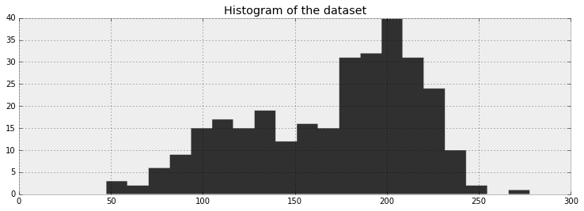

# Markov Chain Monte Carlo

## MCMC

_Markov Chain Monte Carlo_ (_MCMC_).
Knowing the process helps to figure out if algorithm has converged
and understand why we get thousand of samples as a solution.

### Bayesian landscape

When a Bayesian problem with $N$ unknowns
we create an $N$ dimensional space for the prior distribution to exist in.
On top of that space is an additional dimension—
the _surface_ or _curve_ that reflects the _prior probability_ of a particular point.
This surface is defined by prior distributions
If we have two unknowns—
$p_1$ and $p_2$—
and priors for both are $\text{Uniform}(0, 5)$,
the space created is a square of length 5
and the surface is a flat plane
that sits on top of the square.
Every point is equally likely.


If the two priors are $\text{Exp}(3)$ and $\text{Exp}(10)$,
then the space is all positive numbers on the 2D plane
and the surface slopes down from $(0, 0)$.


In practice,
these spaces can be of a much higher dimension.

What happens to this space after the data $X$ is incorporated?
The data $X$ does not change the space,
but it does change the surface by pulling and stretching the fabric of the prior surface
to reflect where the true parameters live.
More data means more distortion,
and original shape becomes insignificant.
The resulting surface describes the _posterior distribution_.

For the simple 2D case the data pushes up the surface to make peaks.
If there was already a peak there due to the prior,
it gets pushed higher.
If the prior has an assigned probability of 0
then no posterior probability will be assigned there.


Even though same data was used to warp,
the result looks different on the two columns.
This influences the warping.

#### MCMC landscape

We should explored the posterior space
generated by our prior surface and observed data
to find the posterior mountain.
However searching a $N$ dimensional space is exponentially difficult in $N$.
MCMC performs an intelligent search of the space.

MCMC returns _samples_ from the posterior distribution,
not the distribution itself.
MCMC asks
_how likely is it for a point to be from the mountain we are searching for?_.
These points are samples,
or _traces_.

MCMC hopefully converges towards an area of high posterior probability.
MCMC accomplishes this by exploring nearly positions
and moving into areas with a higher probability.

#### Why thousand of samples?

Returning a mathematical formula for the mountain peaks
would involve describing an $N$ dimensional surface with arbitrary peaks and valleys.

Returning the peak of a landscape is possible—
as the highest point corresponds to the most probable estimate of unknowns.

But this ignores the shape of the landscape,
which is very important in determining confidence intervals.

Returning samples allows for the use of _the law of large numbers_ to solve problems.
With thousand of samples we can reconstruct the posterior surface
by organizing them in a histogram.

### MCMC algorithms

There are many algorithms that perform MCMC.
Most at a high level are:

1. Start at current position
2. Propose moving to a new position
3. Accept or reject the new position based on the adherence to the data and prior distribution
4. Either move or stay in same position
   and return to step 1
5. After a large number of iterations,
   return all accepted positions

You move in the general direction towards the regions where the posterior distribution exists
and collect sparingly on the journey.
Once you reach the posterior distributution collection samples is easy since you are already there.

If the current position is an area of extremely low probability—
which is common when initializing form a random location—
the algorithms moves to positions that are likely not from the posterior
but better than anything else nearby.
The first few steps of the algorithm are not reflective of the posterior.

In the algorithms only the current position matters—
it is _memoryless_.

### Other approximate solutions to the posterior

There are other procedures besides MCMC.
A Laplace approximation is an approximation of the posterior using simple functions.
A more advanced method is _Variational Bayes_.

### Unsupervised clustering using a mixture model



Given this dataset,
what does it suggest?
Looks bimodal.
We can propose how the data might have been created.
Propose:

1. For each data point,
   choose cluster 1 with probability $p$
   else cluster 2
2. Draw a random variate from a Normal distribution with parameters $\mu_i$ and $\sigma_i$
   where $i$ was chosen in step 1
3. Repeat

We do not know $p$ here.
We must learn it.

Normal distributions $N_0$ and $N_1$.
Both with unknown mean and standard deviation—
$\mu_i$ and $\sigma_i$, $i = 0,1$.

A specific data point can be from either $N_0$ or $N_1$,
and we assume that the data point is assigned to $N_0$ with probability $p$.

PyMC3's `Categorical` stochastic variable can be used to assign data points.
Its parameter is a $k$-length array of probabilities that must sum to 1.
It's `value` attribute is an integer between 0 and $k - 1$ randomly chosen
according to the probability array.
We don't know the probability of assignment to cluster 1,
so we use a uniform variable on $(0, 1)$.
This is $p_1$.
$p_2 = 1 - p_1$

Use  `theano.tensor.stack()` to combine $p_1$ and $p_2$ into a vector.
Pass this vector into `Categorical` and `testval` to give the variable an idea of where to start from.

```python
import numpy as np
import pymc3 as pm
import thano.tensor as T

rng = np.random.default_rng()

with pm.Model() as model:
    p1 = pm.Uniform("p", 0, 1)
    p2 = 1 - p1
    p = T.stack([p1, p2])
    assignment = pm.Categorical(
       "assignment",
       p,
       shape=data.shape[0],
       testval=rng.integers(0, 2, data.shape[0])
    )
```

```python
>>> p1.tag.test_value
0.50
>>> assignment.tag.test_value[:10]
[0 0 0 0 1 1 1 0 0 1]
```

The dataset makes it seem like the standard deviations of the two clusters are different.
To maintain ignorance,
model them as uniform 0–100.

```python
sds = pm.Uniform("sds", 0, 100, shape=2)
```

We model both $\sigma$s as one variable using `shape=2`.
We need to specify priors on the centers of the clusters.
The centers the $\mu$ parameters in the Normal distributions.
Their priors can be modeled by a Normal distribution.
Looking at data,
you can guess the centers are somewhere around 120 and 190.

```python
with model:
   sds = pm.Uniform("sds", 0, 100, shape=2)
   centers = pm.Normal(
      "centers",
      mu=np.array([120, 190]),
      sd=np.array([10, 10]),
      shape=2,
   )
   center_i = pm.Deterministic("center_i", centers[assignment])
   sd_i = pm.Deterministic("sd_i", sds[assignment])
   observations = pm.Normal("obs", mu=center_i, sd=sd_i, observed=data)
```

```python
>>> assignment.tag.test_value[:4]
[0 0 0 0]
>>> center_i.tag.test_value[:4]
[ 120.  120.  120.  120.]
>>> sd_i.tag.test_value[:4]
[ 50.  50.  50.  50.]
```

If we keep working in the context of `model`
all variables are automatically added.
Any sampling done in context of `model` will be done only on `model`.
Tell model to explore the space that you have defined using sampling methods.
`Metropolis()` for continuous variables
and `ElemwiseCategorical()` for categorical variable.
Use with `sample(iterations, step)`,
where `iterations` is the number of steps you wish the algorithm to perform
and `step` is the way in which you handle those steps.

```python
with model:
   step1 = pm.Metropolis(vars=[p, sds, centers])
   step2 = pm.ElemwiseCategorical(vars=[assignment])
   trace = pm.sample(25_000, step=[step1, step2])
```

Store paths of variables in `trace`.
These paths are the routes the variables have taken so far.
`trace["sds"]` returns a NumPy array that we an index and slice.

```python
center_trace = trace["centers"]
std_trace = trace["sds"]
p_trace = trace["p"]
```


The traces converge—
but not to a single point.
They converge to a distribution of possible points.
This convergence is an MCMC algorithm.

Inference using the first few thousand points is a bad idea.
They are unrelated to the final distribution.
It's a good idea to discard those samples before using them for inference.
This is the _burn-in period_.

The traces appear as a random walk around space.
The paths are correlated with the previous positions.
This is good and bad.
There is always a correlation between current positions and the previous,
but too much means the space is not being explored well.

To achieve further convergence perform more MCMC steps.
The current position is stored in `trace`.
Pass `trace` into `sample()` to continue where we left off.
Values will not be overwritten.

```python
with model:
   trace = pm.sample(50_000, step=[step1, step2], trace=trace)
```


#### Cluster investigation

```python
std_trace = trace["sds"][25_000:]
```


Cluster most likely near 120 and 200.

Can also look at distribution of assignment of points to a cluster.


Most uncertainty between 150 and 170.

Even though the clusters were modeled using Normal distributions,
we didn't get a single Normal distribution that best fits the data.
We got a distribution of values for the Normal's parameters.
How do we choose just a single pair of values for the mean and variance?

One quick way is to use the mean of the distributions.

### Don't mix posterior samples

A possible but unlikely scenario is that cluster 0 has a very big standard deviation
and cluster 1 has a small standard deviation.
This would still satisfy the evidence,
but less so than original inference.
It's very unlikely for both distributions to have very small standard deviations
and does not fit the data.
The two standard deviations and dependent on each other.
If one is small,
the other is probably large.
All the unknowns are related in a similar matter.
A small standard deviation restricts the mean to a small area.

During MCMC wer are returned vectors representing samples from the unknown posteriors.
Elements of different vectors cannot be used together.
This breaks the logic outlined above.
A sample that has cluster 1 with a small standard deviation
would have other variables in that sample that would incorporate that and adust accordingly.

### Clustering: prediction

The above clustering can be generalized to $k$ clusters.

We wish to label a new data point to a cluster—
$x = 175$.
Don't just assign it to the closest cluster.
This ignores standard deviation of the clusters.
The assignment of $x$ is $L_x$—
which is 0 or 1.
We are interested in the probability of assignment.

$$
P(L_x = 1 | x = 175)
$$

You could re-run MCMC with the additional point added on.
This is slow.
A less precise method is to use Bayes Theorem.

$$
P( L_x = 1 | x = 175 ) = \frac{ P( x = 175  | L_x = 1 )P(L_x = 1) }{P(x = 175) }
$$

We want to know for a particular sample set of parameters—
$( \mu_0, \sigma_0, \mu_1, \sigma_1, p)$—
if the probability of $x$ being in cluster 1 is greater than cluster 0.

$$
P( x=175  | L_x = 1  )P( L_x = 1 ) \gt  P( x=175  | L_x = 0  )P( L_x = 0 )
$$

You can ignore the denominator here since it is equal on both sides.

```python
norm_pdf = stats.norm.pdf
p_trace = trace["p"][25_000:]
x = 175
v = (
   norm_pdf(x, loc=center_trace[:, 0], scale=std_trace[:, 0]) * p_trace
   >  norm_pdf(x, loc=center_trace[:, 1], scale=std_trace[:, 1]) * (1 - p_trace)
)
```

```python
>>> v.mean()
0.01062
```

We can optimize our guesses using a _loss function_.

### Using MAP to improve convergence

Traces are not deterministic.
They are a function of the _starting values_ of MCMC.
If MCMC runs long enough it forgets its initial position.
If you observe different posterior analysis it's because total convergence has not happened.

Poor starting values can slow down or completely prevent convergence.
It would be ideal to start at the peak—
where the posterior distribution exists.
This peak is called the _maximum posterior_ or _MAP_.

We don't know where the _MAP_ is.
PyMC3 has a `find_MAP` function that approximates (or finds) the MAP location.
If you call it within the context of `Model()` it will calculate the MAP.
You can pass it to `pm.sample()`'s `start`.

```python
start = pm.find_MAP()
trace = pm.sample(2_000, step=pm.Metropolis, start=start)
```

You can choose the optimization algorithms to use.
Default is _Broyden-Fletcher-Goldfarb-Shanno_ (_BFGS_) to find the maximum of the log-posterior.
You can use others from _scipy.optimize_.
_Powell's Method_ is a good one.

```python
find_MAP(fmin=scipy.optimize.fmin_powell)
```

MAP can be used as a solution to an inference problem.
As mathematically it is the most likely value for the unknowns.
This location ignores uncertainty and does not return a distribution.

#### Burn-in

Even if you use `find_MAP()` you should still use a burn-in.
You can discard the beginning of the trace by slicing.
A rule of thumb is to discard the first half of your samples.
Sometimes up to 90% for longer runs.

```python
with pm.Model() as model:
    start = pm.find_MAP()

    step = pm.Metropolis()
    trace = pm.sample(100000, step=step, start=start)

burned_trace = trace[50000:]
```

## Diagnosing convergence

### Autocorrelation

_Autocorrelation_ is a measure of how related a series of numbers is with itself.
1.0 is a perfect positive autocorrelation.
0 is no correlation.
-1 is a perfect negative correlation.
It's similar to standard correlation,
just how correlated a series $x_t$ at time $t$ is with the series at time $t - k$.

$$
R(k) = Corr(x_t, x_{t - k})
$$

Consider the two series

$$
x_t \sim \text{Normal}(0,1), \;\; x_0 = 0 \\
y_t \sim \text{Normal}(y_{t-1}, 1 ), \;\; y_0 = 0
$$

and two paths:

```python
import numpy as np
import pymc3 as pm

rng = np.random.default_rng()
x_t = rng.normal(0, 1, 200)
x_t[0] = 0
y_t = np.zeros(200)
for i in range(1, 200):
    y_t[i] = rng.normal(y_t[i - 1], 1)
```


Can think of correlation as
_if I know the position of the series at time $s$,
can it help me know where I am at time $t$?_

$x_t$ is random,
the previous position does not help.
$y_t$ is autocorrelated.
The further you get from a point though,
the less confident you will get about the guess though.
$k$—
the lag between time points—
increases as the autocorrelation decreases.

#### Relating to MCMC

MCMC will always be returned samples that exhibit autocorrelation.
A chain not exploring space well exhibits very high autocorrelation.
If the trace seems to meander and not settle down,
the chain has high autocorrelation.
A converged MCMC does not mean alow autocorrelation though.
Low autocorrelation is not necessary for convergence,
but is sufficient.
PyMC3 has a built-in autocorrelation plotting function in `plots`.

### Thinning

If there is high-autocorrelation between posterior samples another issue can arise.
Many post-processing algorithms require samples to be independent of each other.
This can be reduced or solved by only returning every $n^{\text{th}}$ sample—
removing some autocorrelation.

With more thinning,
autocorrelation drops quicker.
More thinning requires more MCMC iterations.

As long as the autocorrelation trends to 0 as a function of $k$,
you're probably good.
Over 10 is usually unnecessary.

### pymc3.plots

Pass a `trace` into `pymc3.plots` to plot useful functions.

`pm.plots.traceplot` gives the posterior density of each unknown in the `centers` variable
as well as the `trace` of each.
Useful for inspecting a possible meandering property that is the result of non-convergence.
The density plot gives an idea of the shape of the distribution of each unknown.


`pm.plots.plot_posterior` draws a histogram of the samples.
It shows the posterior mean.
The interval shows the 95% _credible interval_ (_highest posterior density interval_).
This is different than the 95% _confidence interval_.
The credible interval is
_there is a 95% chance the parameter of interest lies in this interval_.


`pm.plots.autocorrplot` generates the autocorrelation plots.


## MCMC tips

### Starting values

Start the MCMC off near the posterior distribution
so it takes little time to start sampling correctly.
We can tell it to start where we think the posterior distribution will be
by specifying the `testval` parameter.
For example,
if we have data from a Normal distribution,
and we wish to estimate $\mu$,
then a good starting point is the mean of the data.

```python
mu = pm.Uniform("mu", 0, 100, testval=data.mean())
```

For most parameters,
there is a frequentist estimate of it—
which are good starting values.
This is not always possible,
but including as many appropriate initial values is always good.
Even if your guess is wrong,
MCMC will still converge.

`MAP` tries to do this.
So why bother?
You can even give `MAP` good values to help it.

Bad initial values are on of the source of major bugs in PyMC3 and convergence.

#### Priors

If priors are chosen poorly,
MCMC may not converge.
If the prior chosen does not contain the true parameter,
the prior assigns a 0 probability to the unknown
and the posterior assigns 0 probability as well.

Carefully choose priors.
