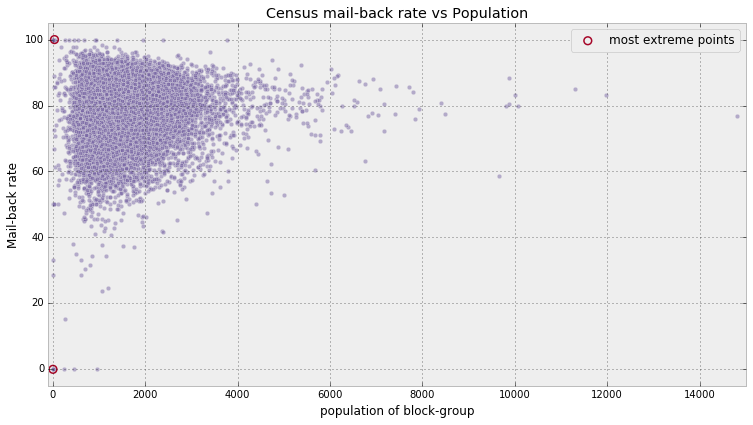

# 4 Law of large numbers

## The law of large numbers

Let $Z_i$ be $N$ independent samples from a probability distribution.
According to the _law of large numbers_,
as long as the expected value $E[Z]$ is finite

$$
\frac{1}{N} \sum_{i=1}^N Z_i \rightarrow E[ Z ],  \;\;\; N \rightarrow \infty.
$$

_The average of a sequence of random variables from the same distribution converges to the expected value of that distribution._

### Intuition

As $N$ increases,
the _rate_ of conversion decreases.
The rate of convergence to $E[Z]$ is

$$
\frac{ \sqrt{ \; Var(Z) \; } }{\sqrt{N} }
$$

For a given large $N$,
we know on average how far away we are from the estimate.

### How to compute $Var(Z)$?

The variance is another expected value that can be approximated.
Once we have the expected value,
we can estimate the variance

$$
\frac{1}{N}\sum_{i=1}^N \;(Z_i - \mu)^2 \rightarrow E[ \;( Z - \mu)^2 \;] = Var( Z )
$$

### Expected values and probabilities

The _indicator function_

$$
\mathbb{1}_A(x) = 
\begin{cases} 1 &  x \in A \\\\
              0 &  else
\end{cases}
$$

Using law of large numbers,
if we have many samples $X_i$,
we can estimate the probability of an event $A$—
$P(A)$,
by

$$
\frac{1}{N} \sum_{i=1}^N \mathbb{1}_A(X_i) \rightarrow E[\mathbb{1}_A(X)] =  P(A)
$$

So if we wish to estimate the probability that a $Z \sim Exp(.5)$ is greater than 5,
and we have many samples from an $Exp(0.5)$ distribution:

$$
P( Z > 5 ) =  \frac{1}{N}\sum_{i=1}^N \mathbb{1}_{z > 5 }(Z_i)
$$

### Tying to Bayesian

_Prior estimates_ are computed using expected values.
In analytical Bayesian inference,
you have to evaluate complicated expected values.
If we can sample from the posterior distribution directly,
we just need to evaluate the averages.
If accuracy is needed,
can look at converging plots
and sample more.

## The disorder of small numbers

The law of large numbers is only valid as $N$ gets infinitely large—
which is impossible.

This can occur in aggregate data.
If we have data on height by country,
where each country in reality has completely equal distributions of height.
If the populations of some countries are very small
they can seem to significantly vary from the actual distribution mean
compared to countries with large populations.
If you look at population sizes of the most extreme cases,
they will typically contain the smaller population sizes.



This is a typical triangular shaped plot.
It tightens as we increase the sample size of the aggregate groups.

Small datasets cannot be processed using the law of large numbers.

### Example: sorting Reddit

Want to sort reddit submission by best post.
Will sort by ratio of upvotes to upvotes + downvotes.

Posts with only a few number of votes may over (or under) perform.
A post with 1 upvote and zero downvotes will have a ratio of 1.0.
A post with 999 upvotes and 1 downvotes will have a ratio of 0.999.
We want to estimate the true upvote ratio.

Can look at historical distribution of upvote ratios.
There are some issues with this though.
The data is skewed.
The majority of posts have very few votes,
so many posts will have ratios in extremes—
skewing the distribution to extremes.
The data is biased.
There are different subreddits.
`r/aww` and `r/politics` likely have different voting behavior.

In light of these issues,
use a Uniform prior.
Find posterior of true upvote ratio.

For a given true upvote ratio $p$ and $N$ votes,
the number of upvotes looks like a Binomial random variable with parameters $p$ and $N$.
This is because of the equivalence between the upvote ratio and the probability of upvoting.

```python
import pymc3 as pm

def posterior_upvote_ratio(upvotes: int, downvotes: int, samples: int = 20_000):
    N = upvotes + downvotes
    with pm.Model() as model:
        upvote_ratio = pm.Uniform("upvote_ratio", 0, 1)
        observations = pm.Binomial("obs", N, upvote_ratio, observed=upvotes)
        trace = pm.sample(samples, step=pm.Metropolis())
    burned_trace = trace[int(samples / 4)]
    return burned_trace["upvote_ratio"]
```


### Sorting

The real goal of the Reddit example is sort from best to worst.
Need scalar numbers for this.
Mean is one way—
but is a bad choice
because it ignores uncertainty.

Use the _95% least plausible value_—
the value such that there is only a 5% change the true parameter is lower.


So best submission are most likely to score a high percentage of upvotes.
Given two submissions with equal upvote ratios,
the one with more votes is considered better.
If two submissions have the same number of votes,
the submission with the most upvotes is considered better.

### Too slow for real-time

$$
\frac{a}{a + b} - 1.65\sqrt{ \frac{ab}{ (a+b)^2(a + b +1 ) } }
$$

where

$$
a = 1 + u \\
b = 1 + d
$$

$u$ is the number of upvotes,
and $d$ is the number of downvotes.

### Extending to starred rating systems

An $N$ star rating system can be seen as a more continuous version of the upvote downvote problem.
We can set $n$ stars rewarded is equivalent to rewarding $\frac{n}{N}$.
In a 5 star system,
2 is 0.4.
Use same formula above where

$$
a = 1 + S \\
b = 1 + N - S
$$

Where $N$ is the number of users who rated,
and $S$ is the sum of all the ratings.

## Conclusion

Take into account how the data is shaped.

- By drawing many samples from the posterior
  you ensure the Law of Large numbers applies as you approximate expected values.
- Bayesian inference understands that with small samples sizes there is large randomness.
  The posterior distribution will reflect this by being more spread out.
- Consider sample size when sorting.
  Use methods like least plausible sorting.
