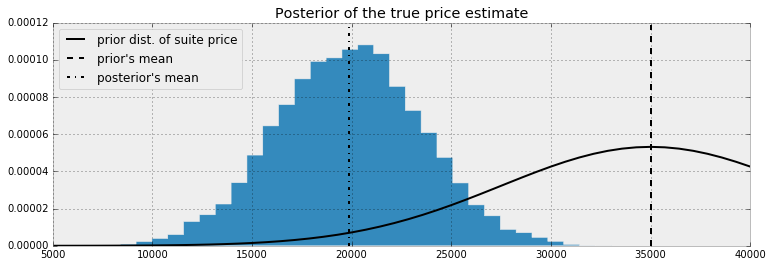

# 5 Loss functions

## Loss functions

A _loss function_ is a function of the true parameter
and the estimate of that parameter.
The larger the loss,
the worse the estimate.

One example is the _squared-error_ loss:

$$
L( \theta, \hat{\theta} ) = ( \theta -  \hat{\theta} )^2
$$

There is also the asymmetric loss function:

$$
L( \theta, \hat{\theta} ) = \begin{cases} ( \theta -  \hat{\theta} )^2 & \hat{\theta} \lt \theta \\\\ c( \theta -  \hat{\theta} )^2 & \hat{\theta} \ge \theta, \;\; 0\lt c \lt 1 \end{cases}
$$

Where estimating a value larger than the true estimate is preferable to a value below.
Useful for estimating web traffic next month—
where over estimating is preferred to avoid issues.

A negative about squared-error is that is puts a disproportionate emphasis on large outliers.
The loss increases quadratically as the estimate moves away.

A more robust loss function that increases linearly with the difference is _absolute-loss_

$$
L( \theta, \hat{\theta} ) = | \theta -  \hat{\theta} |
$$

The zero-one loss is used for classification:

$$
L( \theta, \hat{\theta} ) = \mathbb{1}_{ \hat{\theta} \neq \theta }
$$

The _log-loss_:

$$
L( \theta, \hat{\theta} ) = -\theta\log( \hat{\theta} ) - (1- \theta)\log( 1 - \hat{\theta} ), \; \; \theta \in {0,1}, \; \hat{\theta} \in [0,1]
$$

Loss functions are mathematically convenient and are objective measures of loss.

Can emphasize an estimate closer to 0 or 1—
since the true value $\theta$ is near 0 or 1—
using:

$$
L( \theta, \hat{\theta} ) = \frac{ | \theta - \hat{\theta} | }{ \theta(1-\theta) }, \; \; \hat{\theta}, \theta \in [0,1]
$$

The loss will be very large unless $\hat{\theta}$ is closet to 0 or 1.
This loss function can be used if the problem requires confident yes or no answers.

Can bound a loss between 0 and 1
and reflect that the user is indifferent to sufficiently far away estimates:

$$
L( \theta, \hat{\theta} ) =  1 - \exp \left( -(\theta -  \hat{\theta} )^2 \right)
$$

### Loss functions in the real world

We don't know the true parameter.
So the loss function can be used when true parameter is unknown.

Unknown parameters are random variables with prior and posterior distributions.
A value drawn from a posterior distribution is a possible realization of what the true parameter could be.
Given that we can compute the _expected loss_—
a better estimate of the true loss than comparing the loss from a single parameter from the posterior.

Suppose $P(\theta X)$ is the posterior distribution of $\theta$ after observing data $X$.
The _expected loss of choosing $\hat{\theta}$ to estimate $\theta$_ is:

$$
l(\hat{\theta} ) = E_{\theta}\left[ \; L(\theta, \hat{\theta}) \; \right]
$$

This is also known as the _risk_ of estimating $\hat{\theta}$.

Using the law of large numbers,
we can approximate the expected loss:

$$
\frac{1}{N} \sum_{i=1}^N \;L(\theta_i, \hat{\theta} ) \approx E_{\theta}\left[ \; L(\theta, \hat{\theta}) \; \right]  = l(\hat{\theta} )
$$

Measuring your loss via an _expected value_ uses more information from the distribution
than the MAP estimate—
which only finds the maximum value of the distribution and ignores the shape.

### Optimizing for the showcase on The Price is Right

Rules:

1. Two contestants compete
2. Each contestant is shown a unique suite of prizes
3. After viewing both are asked to bid on the price for their prizes
4. If a bid is over the actual price they are disqualified from winning
5. If you bid under the price by less than $250 you get both prizes

We have data from previous episodes and have prior beliefs about what the distribution the true price follows.

$$
\text{True Price} \sim \text{Normal}(\mu_p, \sigma_p )
$$

Assume $\mu_p = 35,000$ and $\sigma_p = 7,500$.

Your beliefs about the prices of prizes also follow Normal distributions.

$$
\text{Prize}_i \sim \text{Normal}(\mu_i, \sigma_i ),\;\; i=1,2
$$

We can specify what we think a fair price is through $\mu_i$
and express uncertainty of our guess with $\sigma_i$.

Given two prizes,
the true price of the prizes are:

$$
\text{Prize}_1 + \text{Prize}_2 + \epsilon
$$

Where $\epsilon$ is an error term.

Given two items—
a trip to Toronto
and a snowblower—
we can give our estimates and uncertainties:

$$
\text{snowblower} \sim \text{Normal}(3 000, 500 ) \\
\text{Toronto} \sim \text{Normal}(12 000, 3000 )
$$

So we think a trip to Toronto costs 12,000
with a 68.2% chance that the price is one standard deviation away from this.
We think there is a 68.2% change the trip is in $[9,000, 15,000]$.

Infer the true price of the suite.

```python
import pymc3 as pm

data_mu = [3e3, 12e3]
data_std = [5e2, 3e3]

mu_prior = 35e3
std_prior = 75e2
with pm.Model() as model:
    true_price = pm.Normal("true_price", mu=mu_prior, std=std_prior)
    prize_1 = pm.Normal("first_price", mu=data_mu[0], sd=data_std[0])
    prize_2 = pm.Normal("second_price", mu=data_mu[1], sd=data_std[1])
    price_estimate = prize_1 + prize_2

    logp = pm.Normal.dist(mu=price_estimate, sd=(3e3)).logp(true_price)
    error = pm.Potential("error", logp)

    trace = pm.sample(50_000, step=pm.Metropolis())
    burned_trace = trace[10_000:]
```

```python
price_trace = burned_trace["true_price"]
```



We can see the true price posterior is shifted down to $20,000.
We can use a loss function to find the best bid incorporating uncertainties.

```python
def showcase_loss(guess, true_price, risk=80_000):
    if true_price < guess:
        return risk
    elif abs(true_price - guess) <= 250:
        return -2 * np.abs(true_price)
    else:
        return np.abs(true_price - guess - 250)
```

Where `risk` is a parameter that defines how bad it is if you guess over the true price.
A lower risk means that you are more comfortable with the idea of going over.

For every possible bid we calculate the _expected loss_.

```python
def showdown_loss(guess, true_price, risk = 80_000):
    loss = np.zeros_like(true_price)
    ix = true_price < guess
    loss[~ix] = np.abs(guess - true_price[~ix])
    close_mask = [abs(true_price - guess) <= 250]
    loss[close_mask] = -2 * true_price[close_mask]
    loss[ix] = risk
    return loss

guesses = np.linspace(5_000, 50_000, 70)
risks = np.linspace(30_000, 150_000, 6)
expected_loss = lambda guess, risk: showdown_loss(guess, price_trace, risk).mean()
```


### Minimizing our losses

Choose the estimate that minimizes our expected loss.
This is the minimum point on each of the curves above.
Want to minimize the expected loss by finding the solution to

$$
\text{arg} \min_{\hat{\theta}} \;\;E_{\theta}\left[ \; L(\theta, \hat{\theta}) \; \right]
$$

The _Bayes action_ is the minimum of the expected loss.
`scipy.optimize.fmin` uses an intelligent search to find a
(not necessarily global)
minimum of an uni or multivariate function.

If we increase the risk threshold we increase our bid.

### Shortcuts

For some loss functions,
The Bayes action is known in closed form.

For mean-squared loss the Bayes action is the mean of the posterior distribution.
The value $E_{\theta}\left[ \theta \right]$ minimizes $E_{\theta}\left[ \; (\theta - \hat{\theta})^2 \; \right]$.
This requires us to calculate the average of the posterior samples.

The expected absolute loss is minimized by the median of the posterior distribution.
The sample median of the posterior samples is an accurate approximation of the true median.

The zero-one loss solution is the MAP estimate.

## Machine learning via bayesian methods

Frequentist methods optimize the precision about all possible parameters.
Machine learning optimizes the best prediction among all possible parameters.
Least-squared linear regression determines coefficients using squared-error loss.
But prediction loss function can be something else
like AUC, ROC, precision, etc.

Finding Bayes actions is equivalent to finding parameters that optimize not for parameter accuracy,
but an arbitrary performance measure.

### Financial prediction

Suppose the return of a stock price is small—
1%.
We model the stock's future price.
How should you measure the loss associated with the model's predictions.
A squared-error loss is agnostic to the sign
and would penalize a prediction of 0.01 equally as 0.03.

But would would earn money with a prediction of 0.03,
and loose money with a prediction of -0.01.

```python
def stock_loss(true_return: float, yhat: float, alpha: float = 100.):
    if true_return * yhat < 0:
        # Opposite signs
        return alpha * yhat ** 2 - np.sign(true_return) * yhat + abs(true_return)
    else:
        return abs(true_return - yhat)
```


We really don't want the wrong sign.
Especially be wrong by a large magnitude.


Data is linear,
so model with:

$$
R = \alpha + \Beta x + \epsilon
$$

Where $\alpha$ and $\beta$ are unknown parameters
and $\epsilon \sin \text{Normal}(0,\sigma)$.
The most common priors on $\beta$ and $\alpha$ are Normal.
We can also assign a prior to $\sigma$—
Uniform 0–100.

```python
import pymc3 as pm

with pm.Model() as model:
    std = pm.Uniform("std", 0, 100)
    beta = pm.Normal("beta", mu=0, std=100)
    alpha = pm.Normal("alpha", mu=0, sd=100)
    mean = pm.Deterministic("mean", alpha + beta * X)
    obs = pm.Normal("obs", mu=mean, sd=std, observed=Y)
    trace = pm.sample(100_000, step=pm.Metropolis())
    burned_trace = trace[20_000:]
```

For a specific trading signal $x$,
the distributions of possible returns has the form

$$
R_i(x) = \alpha_i + \beta_i x + \epsilon
$$

where $\epsilon \sim \text{Normal}(0, \sigma)$ and $i$ indexes our posterior samples.
We wish to find the solution to

$$
\arg \min_{r} \;\;E_{R(x)}\left[ \; L(R(x), r) \; \right]
$$

According to the defined loss function.
$r$ is our Bayes action for trading signal $x$.
Plot the Bayes action over different trading signals.

```python
from scipy.optimize import fmin


def stock_loss(price, pred, coef: int=500):
    """Vectorized loss."""
    sol = np.zeros_like(price)
    ix = price * pred < 0
    sol[ix] = coef * pred ** 2 - np.sign(price[ix]) * pred + abs(price[ix])
    sol[~ix] = abs(price[~ix] - pred)
    return sol

std_samples = burned_trace["std"]
alpha_samples = burned_trace["alpha"]
beta_samples = burned_trace["beta"]

N = std_samples.shape[0]
noise = std_samples * np.random.randn(N)
possible_outcomes = lambda signal: alpha_samples + beta_samples * signal + noise

opt_predictions = np.zeros(50)
trading_signals = np.linspace(X.min(), X.max(), 50)
for i, _signal in enumerate(trading_signals):
    _possible_outcomes = possible_outcomes(_signal)
    tomin = lambda pred: stock_loss(_possible_outcomes, pred).mean()
    opt_predictions[i] = fmin(tomin, 0, disp=False)
```


When the signal is near 0—
and many of the possible return outcomes are possibly both positive and negative—
the best prediction is to predict close to 0.

Sanity check is that as signal becomes more extreme
the model becomes more confident
and the position converges to that of the least-squares line.

This model will not fit the data the best.
It is trying to find the best prediction with respect to the defined loss.

### Observing dark world

Find the most likely locations for dark matter.

1. Construct a prior distribution for the halo positions $p(x)$
   Formulate our expectations about the halo positions before looking at the data.
2. Construct a probabilistic model for the data
   given the positions of dark matter halos $p(e | x)$.
3. Use Baye's rule to get the posterior distribution of the halo positions.
4. Minimize the expected loss with respect to the posterior distribution over the predictions.
   
### The data

The dataset is 300 separate files representing a sky.
In each sky are 300–720 galaxies.
Each galaxy has an $x$ and $y$ associated with it
and measures of ellipticity $e_1$ and $e_2$.


### Priors

Each sky has 1–3 dark matter halos in it.
Let the prior distributions be uniform.

$$
x_i \sim \text{Uniform}( 0, 4200) \\
y_i \sim \text{Uniform}( 0, 4200), \;\; i=1,2,3
$$

Most skies have one large halo.
Others are much smaller.

Large halos have a mass distributed as a log-uniform random variable between 40–180.

$$ 
m_{\text{large} } = \log \text{Uniform}( 40, 180 )
$$

```python
exp_mass_large = pm.Uniform("exp_mass_large", 40, 180)
mass_large = pm.Deterministic("mass_large", np.log(exp_max_large))
```

For smaller galaxies,
the mass is the logarithm of 20.
Why not create a prior for the smaller mass,
nor treat is as an unknown?
To speed up convergence of the algorithm.

Assume the ellipticity of each galaxy is dependent on the position of the halos,
the distance between the galaxy and the halo,
and the mas of the halos.
The vector of ellipticity $e_i$ are _children_ variables of the vector of halo positions ($x$, $y$),
distance,
and halo masses.

$$
e_i | ( \mathbf{x}, \mathbf{y} ) \sim \text{Normal}( \sum_{j = \text{halo positions} }d_{i,j} m_j f( r_{i,j} ), \sigma^2 )
$$

Assume a relationship above.
Where $d_{i,j}$ is the _tangential direction_—
the direction which halo _j_ bends the light of galaxy _i_.
$m_j$ is the mass of halo $j$.
$f(r_{i,j})$ is the _decreasing function_ of the distance between halo $j$ and galaxy $i$.

The function for large halos is:

$$
f( r_{i,j} ) = \frac{1}{\min( r_{i,j}, 240 ) }
$$

For small halos it is

$$
f( r_{i,j} ) = \frac{1}{\min( r_{i,j}, 70 ) }
$$

### PyMC3 implementation

For each sky run the Bayesian model to find posteriors.
Ignore the known halo position.

```python
import pymc3 as pm
import theano.tensor as T

def euclidean_distance(x, y):
    return np.sqrt(((x - y) ** 2)).sum(axis=1)


def f_distance(gxy_pos, halo_pos, c):
    return T.maximum(euclidean_distance(gxy_pos, halo_pos), c)[:, None]


def tangential_distance(glxy_position, halo_position):
    delta = glxy_position - halo_position
    t = (2 * T.arctan(delta[:, 1] / delta[:, 0]))
    return T.stack([-T.cos(t), -T.sin(t)], axis=1)


with pm.Model() as model:
    mass_large = pm.Uniform("mass_large", 40, 180)

    halo_position = pm.Uniform("halo_position", 0, 4_200, shape=(1, 2))

    mean = pm.Deterministic(
        "mean",
        mass_large
        / f_distance(T.as_tensor(data[:, :2]), halo_position, 240)
        * tangential_distance(T.as_tensor(data[:, :2]), halo_position),
    )
    ellpty = pm.Normal("ellipcity", mu=mean, tau=1. / 0.05, observed=data[:, 2:])


with model:
    mu, sds, elbo = pm.variational.advi(n=50_000)
    step = pm.NUTS(scaling=model.dict_to_array(sds), is_cov=True)
    trace = pm.sample(5_000, step=step, start=mu)
```

Use ADVI to find a good starting point and scaling for NUTS sampler.
NUTS is a smarter MCMC sampling method than Metropolis,
so we need less samples to converge.
ADVI uses a different methodology to fit a model.

Use the loss function to optimize the location.
You can simply choose mean,
but this would ignore the loss function.
