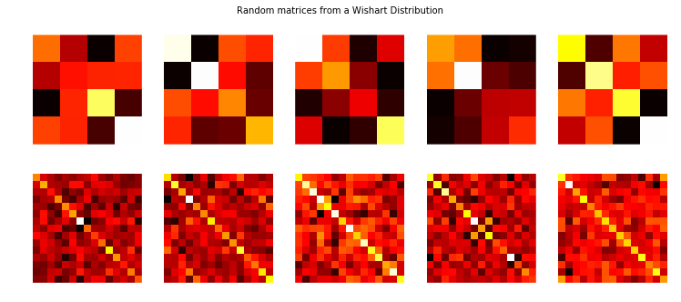

# 6 Priors

## Subjective vs objective priors

_Objective priors_ aim to allow the data to influence the posterior the most.
_Subjective priors_ allow the use to express their views.

Using a Uniform prior over every possible value is an objective prior—
it gives each possible value an equal weighting.
If the uniform range is restricted,
then it is no longer objective.

### Subjective priors

A subjective prior can be used to inject domain knowledge.

### Deciding

After the model is fit,
you should look at the posterior distribution to see if it makes sense.
If it does not make sense,
then prior knowledge is available that has not been included.
Go back and alter the prior distribution to be more consistent.

Using Uniform distributions with large bounds are an okay objective prior.
But they can assign too large of a prior probability to non-intuitive points.
Normal random variable with large variance might be better,
or an Exponential with a fat tail in the strictly positive/negative case.

### Empirical Bayes

_Empirical Bayes_ is a trick that combines frequentist and Bayesian inference.
It uses frequentists methods to select hyperparameters.

If we want to estimate $\mu$ of a Normal distribution with $\sigma = 5$.
Since $\mu$ could be any real number,
we can can use a Normal distribution as a prior for $\mu$.
The prior has hyperparameters $\mu_p$ and $\sigma_p$.
$\sigma_p$ can be used to reflect the uncertainty we have.
For $\mu_p$:

1. Empirical Bayes suggests to use the empirical sample mean,
   which centers the prior around the observed empirical mean:

   $$
   \mu_p = \frac{1}{N} \sum_{i=0}^N X_i
   $$

2. Traditional Bayeian inference suggests using prior knowledge
   or a more objective prior like a zero mean and fat standard deviation.

Empirical Bayes might be seen as double-counting data.
We use the data twice—
once in the prior
and again in MCMC.
This underscores true uncertainty.
If you want to minimize double-counting,
use Empirical bayes only when you have lots of observations.
If possible maintain a high uncertainty (large $\sigma_p^2$).

## Useful priors to know about

### Gamma distribution

$$
\Gamma(\alpha)
$$

$$
f(x \mid \alpha, \beta) = \frac{\beta^{\alpha}x^{\alpha-1}e^{-\beta x}}{\Gamma(\alpha)}
$$

_Gamma_ is a generalization of the Exponential random variable:

$$
\text{Exp}(\beta) \sim \text{Gamma}(1, \beta)
$$

The additional parameter allows for more flexibility.


### Wishart distribution

Random matrix.
A distribution over all positive semi-definite matrices.
Proper covariance matrices are positive-definite.
The Wishart is a good prior for covariance matrices.
It has a symmetry to it.



### Beta distribution

$$
f_X(x | \; \alpha, \beta ) = \frac{ x^{(\alpha - 1)}(1-x)^{ (\beta - 1) } }{B(\alpha, \beta) }
$$

The random variable $X$ is only allowed in $[0, 1]$.
Beta is useful for decimal values,
probabilities, and proportions.
$\alpha$ and $\beta$—
the parameters—
are positive values.


We can see that $(1.0, 1.0)$ gives a flat distribution.
This is the Uniform distribution.
Beta is a generalization of the uniform distribution.

If we are interested in some unknown proportion or probability $p$.
We assign $\text{Beta}(\alpha, \beta)$ prior to $p$.
We observe some data generated by a Binomial process—
$X \sim \text{Binomial}(N, p)$.
Our posterior is again a Beta distribution—
$p | X \sim \text{Beta}( \alpha + X, \beta + N -X )$.
_A Beta prior with Binomial observations creates a Beta posterior._
If we start with $\text{Beta}(1,1)$ prior on $p$—
a uniform distribution—
and observe data $X \sim \text{Binomial}(N, p)$,
then our posterior is $\text{Beta}(1 + X, 1 + N - X)$.

## Bayesian multi-arm bandits

If you are faced with $N$ slot machines.
Each has an unknown probability of distributing a prize.
By only choosing one per round,
devise a strategy to maximize winnings.

If you knew which slot machine had the largest probability you would always pick it.
So strategy is to pick best machine as quickly as possible.

### Applications

- Internet display advertising.
  Companies have a suite of potential ads they can display to visitors,
  but not sure which one to show.
  Similar to A/B testing,
  but you minimize strategies that do not work.
- Finance.
  Choose which stock is the best to return under time-varying return profiles.

### Proposed solution

An _online algorithm_—
specifically a _reinforcement learning algorithm_.
It starts in an ignorant state
and begins to acquire data by testing the system.

For each round:

1. Sample a random variable $X_b$ from the prior of bandit $b$ for all $b$.
2. Select the bandit with the largest sample $B = \text{argmax } X_b$.
3. Observe the result of pulling bandit $B$
   and update your prior on bandit $B$.
4. Repeat

The initial priors are $\text{Beta}(\alpha=1, \beta=1)$ (Uniform)
and the observed result $X$ (a  win or loss, encoded 1 and 0)
is binomial,
the posterior is $\text{Beta}(\alpha = 1 + X, \beta = 1 + 1 - X)$.

We do not discard losers
but pick them at a decreasing rate.

### A measure of good

The best bandit's probability is $w_{opt}$.
Our score should be relative to how well we would have done had we chosen the best bandit from the beginning.

$$
R_T = \sum_{i=1}^{T} \left( w_{opt} - w_{B(i)} \right) \\
= Tw^* - \sum_{i=1}^{T} \;  w_{B(i)}
$$

Where $w_{B(i)}$ is the probability of a prize of the chosen bandit in the $i$ round.
A total regret of 0 means the strategy matching the best possible score.
The strategy's total regret should flatten as it learns the best bandit.

### Extending the algorithm

If you are interested in the minimum probability choose $B = \text{argmin } X_b$ instead.

If the underlying environment changes over time,
the standard algorithm would self update by itself.
We can motivate this further by adding a rate term upon updating.

We can set up a bandit algorithm on top of other smaller bandit algorithms.
If we have $N$ models,
each varying in some behavior.
On top of these $N$ models is another Bayesian Bandit learner that selects a sub-Bayesean Bandit.
The chosen then makes an internal choice on what machine to pull.
This updates itself depending on whether the sub-Bayesian Bandit was correct.

Extend the rewards—
$y_a$—
for bandit $a$ to random variables from a distribution.

## Expert prior

A subjective prior is how you incorporate domain knowledge about a problem into framework.
This:

- Increases speed of MCMC convergence.
- More accurate
- Express uncertainty better

### Trial roulette method

The _trial roulette method_ builds a prior distribution by placing counters on what the expert thinks are possible outcomes.
From this we can fit a distribution to that capture's the expert's choice.

### Stock returns

We can get priors for the price of different stocks from an expert.

Look at _covariance matrix_ of returns
since stocks can be highly correlated.
Use _Wishart distribution_ for this.

```python
prior_mu = np.array([x[0] for x in expert_prior_params.values()])
prior_std = np.array([x[1] for x in expert_prior_params.values()])
init = stock_returns.cov()

with pm.Model() as model:
    cov_matrix = pm.WishartBartlett(
      "covariance", np.diag(prior_std ** 2), 10, testval=init
    )
    mu = pm.Normal("returns", my=prior_mu, sd=1, shape=4)
    obs = pm.MvNormal(
        "observed returns", mu=mu, cov=cov_matrix, observed=stock_returns
    )
    step = pm.NUTS()
    trace = pm.sample(5_000, step=step)
```

The mu posterior distribution will give us the expected returns.

The Wishart distribution models the _inverse covariance matrix_.
We must invert it to get the covariance matrix.
Can normalize it to get teh _correlation matrix_.

Can use this to look at volatility.
You can use a mean-variance optimizer—
_which you should never use with frequentist point estimates_—
and find the minimu.
The optimizer balances the tradeoff between high return and variance.

### Tips for Wishart distribution

The Wishart distribution rarely behaves well.
Estimating an $N \times N$ covariance matrix involves estimating $\frac{1}{2} N (N - 1)$ unknowns.

Tips:

1. Use conjugacy if it applies.
2. Use a good starting value.
   The data's sample covariance is a good start.
   It is best to truncate the floats in the sample covariance down a few degrees of precision.
3. Provide domain knowledge in priors.
4. Use empirical bayes if domain knowledge priors are not possible.
   Use the sample covariance matrix as the prior's parameter.
5. If $N$ is large enough, nothing will help.
   Focus on the most important unknowns.

## Conjugate priors

A $\text{Beta}$ prior with $\text{Binomial}$ data implies a $\text{Beta}$ posterior.
This allows us to avoid using MCMC
since the posterior is known in closed form.

$$
\underbrace{\text{Beta}}_{\text{prior}} \cdot \overbrace{\text{Binomial}}^{\text{data}} = \overbrace{\text{Beta}}^{\text{posterior} }
$$

Suppose $X$ comes from distribution $f_\alpha$.
where $\alpha$ are possibly unknown parameters of $f$.
There may exists a prior $p$ such that:

$$
\overbrace{p_{\beta}}^{\text{prior}} \cdot \overbrace{f_{\alpha}(X)}^{\text{data}} = \overbrace{p_{\beta'}}^{\text{posterior} }
$$

Where $\beta^\prime$ is a different set of parameters
but $p$ is the same distribution as the prior.

The conjugate prior is not objective.
It is only useful when a subjective prior is required.

Typically,
conjugate priors exits for simple one-dimensional problems.

## Jeffery's Prior

Objective priors are rarely actually objective.
We want a prior that does not bias our posterior estimates.

The flat prior seems reasonable as it assigns equal probability to all values.
But it is not transformant invariant.
We have a random variable $X$ from $\text{Bernoulli}(\theta)$ and define a prior on $p(\theta) = 1$.
If we transform $\theta$ with the function $\psi = \log\frac{\theta}{\theta - 1}$.
Now the prior is no longer flat.

Jeffrey's prior creates a prior that is not informative when you transform the variables you place them on.

## Prior as $N$ increases

As the amount of our observations of data increases,
the influence of the prior decreases.
Inference converges regardless of the prior
as long as the areas of non-zero probabilities are the same.
